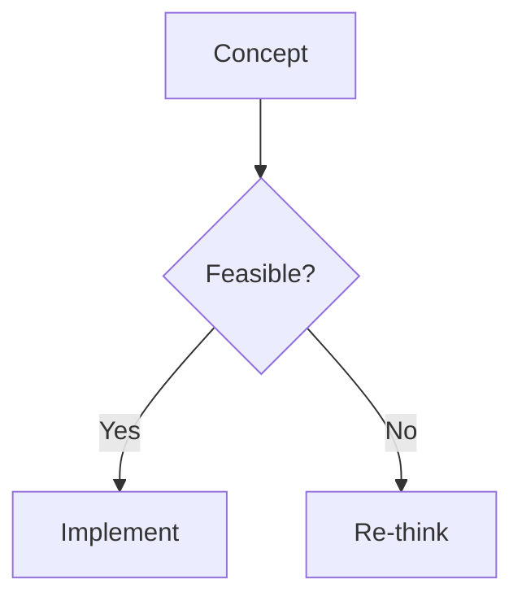

# Working with Your Zero-Latency Hugo Blog

This guide explains how to create content, use the custom features (Mermaid, Excalidraw, Math), and manage this specific project structure.

## 1. Creating Content

### New Posts
Create a new markdown file in `content/posts/`. You can copy the format of an existing post or use the Hugo CLI (if installed globally):
```bash
hugo new posts/my-new-post.md
```
Or simply create the file manually:
`content/posts/my-topic.md`

### Front Matter
Every file must start with "Front Matter" (metadata) in TOML format (+++):
```toml
+++
title = "My Article Title"
date = 2025-12-19
draft = false
summary = "A brief summary for the home page."
+++
```

## 2. Special Features (Zero-Latency)

### Architecture Diagrams (Mermaid)
We use a **build-time** rendering strategy. You write standard Mermaid code blocks, and our build script converts them to SVGs.

**Syntax:**


**Important:** When running `hugo server`, you will see the *code block*. When running `npm run build`, it becomes an *image*.

### Whiteboard Sketches (Excalidraw)
1. Save your Excalidraw export as an `.svg` file.
2. Place it in `assets/`.
3. Use the shortcode:
   ``

### Math Formulas (KaTeX)
Write standard LaTeX math. The build script allows for server-side rendering strategies (conceptually), though currently, our postbuild script focuses heavily on Mermaid. 
*Note: For fully robust math support without client-side JS, you might need to extend `scripts/postbuild.js` to process KaTeX delimiters if they aren't auto-handled.*

## 3. Directory Structure via "Shift Left" Philosophy

- **`content/`**: Your words.
- **`layouts/`**: Your HTML structure.
  - `baseof.html`: The master template with **Critical CSS** inlined.
  - `single.html`: How a post looks.
  - `list.html`: How the homepage looks.
- **`static/`**: Images, favicon (copied as-is).
- **`scripts/`**: The "Build Agents" logic (Node.js scripts) that runs after Hugo to polish the HTML.

## 4. Commands

| Command | Purpose |
|---------|---------|
| `hugo server` | **Write Mode**. Fast, live reloading. Diagrams show as code. |
| `npm run build` | **Production Mode**. Runs Hugo + Node scripts. Generates `public/`. |
| `npx serve public` | **Preview Mode**. View the final Zero-JS result locally. |

## 5. Deployment
Push to GitHub. The workflow in `.github/workflows/hugo.yml` picks it up and pushes to Cloudflare Pages automatically.
