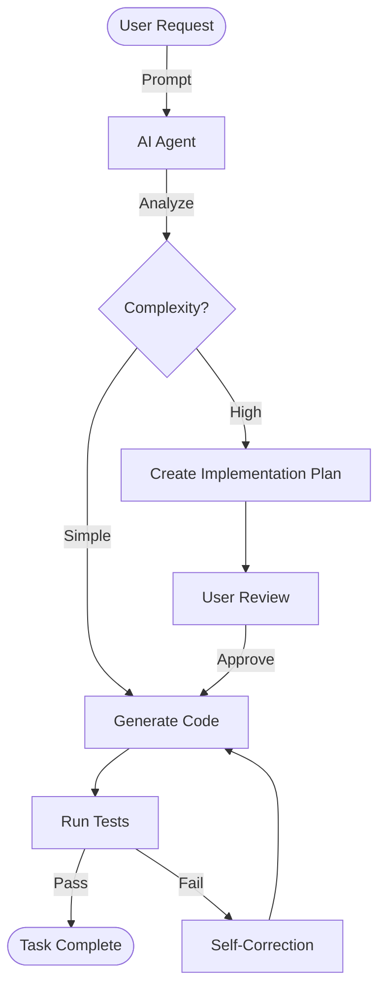

+++
title = "Mastering Agentic Coding"
date = 2024-12-19T00:00:00+05:30
draft = false
summary = "Unlock the power of AI pair programming with tools like Copilot and DeepMind's agents."
+++

Software development is undergoing a paradigm shift. We are moving from *writing* code to *architecting* solutions with **Agentic AI**.

## What is Agentic Coding?

Unlike simple autocomplete, agentic coding involves AI systems that can:

1.  **Plan**: Break down complex tasks.
2.  **Execute**: Write and modify files across a workspace.
3.  **Verify**: Run tests and fix their own mistakes.

## The Interaction Loop

Effective collaboration with an agent looks like a feedback loop. Using our **Zero-Latency** build pipeline, we can visualize this process using a build-time rendered Mermaid diagram:



## Code Example

Here is how you might initialize an agent in Python. Notice how our **Chroma** highlighter handles this without client-side JS:

```python
class CodingAgent:
    def __init__(self, model_name):
        self.model = load_model(model_name)
        self.memory = []

    def think(self, user_input):
        plan = self.model.generate_plan(user_input)
        return self.execute(plan)

    def execute(self, plan):
        print(f"Executing: {plan}")
        # Magical agent logic here
        return True
```

## Conclusion

Embrace the agents. They are here to make us faster, not to replace the architect.
